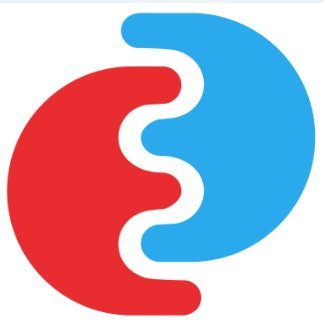

<!-- PROJECT SHIELDS -->
<!--
*** See the bottom of this document for the declaration of the reference variables
*** for contributors-url, forks-url, etc. This is an optional, concise syntax you may use.
*** https://www.markdownguide.org/basic-syntax/#reference-style-links
-->

[![Contributors][contributors-shield]][contributors-url]
[![Forks][forks-shield]][forks-url]
[![Stargazers][stars-shield]][stars-url]
[![Issues][issues-shield]][issues-url]
[![MIT License][license-shield]][license-url]
![Build][build-shield]

<!-- PROJECT LOGO -->
 

  

  <h3 align="center">EOEPCA Minio Bucket API</h3>

  

    This repository includes the EOEPCA OpenStack Bucket API component
     
    <a href="https://github.com/EOEPCA/rm-openstack-bucket-api"><strong>Explore the docs »</strong></a>
     
    <a href="https://github.com/EOEPCA/rm-openstack-bucket-api">View Demo</a>
    ·
    <a href="https://github.com/EOEPCA/rm-openstack-bucket-api/issues">Report Bug</a>
    ·
    <a href="https://github.com/EOEPCA/rm-openstack-bucket-api/issues">Request Feature</a>
  

<!-- TABLE OF CONTENTS -->

## Table of Contents

- [About the Project](#about-the-project)
  - [Built With](#built-with)
- [Getting Started](#getting-started)
  - [Installation](#installation)
- [Documentation](#documentation)
- [Roadmap](#roadmap)
- [Contributing](#contributing)
- [License](#license)
- [Contact](#contact)
- [Acknowledgements](#acknowledgements)

<!-- ABOUT THE PROJECT -->

## About The Project

During workspace creation the `workspace-api` needs to create an object storage bucket for the user. The method by which the bucket is created is a function of the hosting infrastructure object storage layer - i.e. there is no ‘common’ approach for the `workspace-api` to perform the bucket creation.

In order to allow this bucket creation step to be customised by the platform integrator, the `workspace-api` is configured with a webhook endpoint that is invoked to effect the bucket creation on behalf of the `workspace-api`.

The OpenStack Bucket API provides an implementation of a Bucket Creation Webhook for an OpenStack S3 Object Storage backend. This can be used for a production deployment with an OpenStack-based deployment environment.

### Built With

- Kubernetes Java API

<!-- GETTING STARTED -->

## Getting Started

### Installation

The OpenStack Bucket API is deployed via the rm-openstack-bucket-api helm chart from the EOEPCA [Helm Chart Repository](https://eoepca.github.io/helm-charts) - ref. [Helm Chart for the OpenStack Bucket API](https://github.com/EOEPCA/helm-charts/blob/main/charts/rm-openstack-bucket-api).

  helm install --version 0.0.4 --values openstack-bucket-api-values.yaml \
    --repo https://eoepca.github.io/helm-charts \
    rm-openstack-bucket-api rm-openstack-bucket-api

## Documentation

The component documentation can be found at https://deployment-guide.docs.eoepca.org/current/eoepca/workspace/#bucket-creation-webhook

<!-- USAGE EXAMPLES -->

<!-- ROADMAP -->

## Roadmap

See the [open issues](https://github.com/EOEPCA/rm-openstack-bucket-api/issues) for a list of proposed features (and known issues).

<!-- CONTRIBUTING -->

## Contributing

Contributions are what make the open source community such an amazing place to be learn, inspire, and create. Any contributions you make are **greatly appreciated**.

1. Fork the Project
2. Create your Feature Branch (`git checkout -b feature/AmazingFeature`)
3. Commit your Changes (`git commit -m 'Add some AmazingFeature'`)
4. Push to the Branch (`git push origin feature/AmazingFeature`)
5. Open a Pull Request

<!-- LICENSE -->

## License

Distributed under the Apache-2.0 License. See `LICENSE` for more information.

<!-- CONTACT -->

## Contact

Project Link: [https://github.com/EOEPCA/rm-openstack-bucket-api](https://github.com/EOEPCA/rm-openstack-bucket-api)

<!-- ACKNOWLEDGEMENTS -->

## Acknowledgements

- README.md is based on [this template](https://github.com/othneildrew/Best-README-Template) by [Othneil Drew](https://github.com/othneildrew).

<!-- MARKDOWN LINKS & IMAGES -->
<!-- https://www.markdownguide.org/basic-syntax/#reference-style-links -->

[contributors-shield]: https://img.shields.io/github/contributors/EOEPCA/rm-openstack-bucket-api.svg?style=flat-square
[contributors-url]: https://github.com/EOEPCA/rm-openstack-bucket-api/graphs/contributors
[forks-shield]: https://img.shields.io/github/forks/EOEPCA/rm-openstack-bucket-api.svg?style=flat-square
[forks-url]: https://github.com/EOEPCA/rm-openstack-bucket-api/network/members
[stars-shield]: https://img.shields.io/github/stars/EOEPCA/rm-openstack-bucket-api.svg?style=flat-square
[stars-url]: https://github.com/EOEPCA/rm-openstack-bucket-api/stargazers
[issues-shield]: https://img.shields.io/github/issues/EOEPCA/rm-openstack-bucket-api.svg?style=flat-square
[issues-url]: https://github.com/EOEPCA/rm-openstack-bucket-api/issues
[license-shield]: https://img.shields.io/github/license/EOEPCA/rm-openstack-bucket-api.svg?style=flat-square
[license-url]: https://github.com/EOEPCA/rm-openstack-bucket-api/blob/master/LICENSE
[build-shield]: https://www.travis-ci.com/EOEPCA/rm-openstack-bucket-api.svg?branch=master

